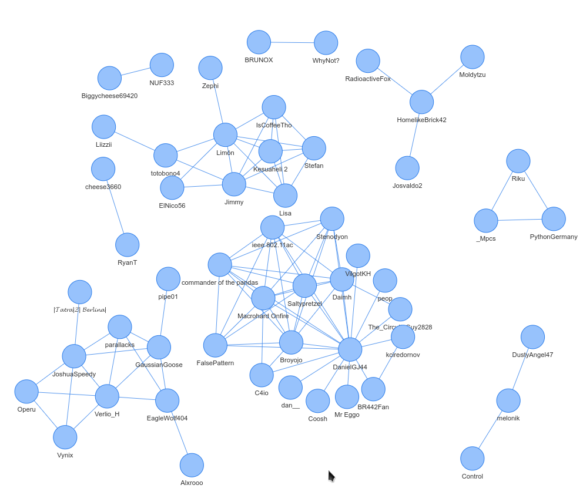

# Discord Sticker Scraper
 Image courtesy of lametern#3911 on the Logic World Discord server.

## Description
This project was made to investigate how user's stickers were chosen on the [Logic World Discord server](https://discord.gg/XBB3UffgNu). This program uses a Discord bot to scrape messages that contain stickers and compares what stickers people have to the same person joining the server. The image above is not generated by this program, but uses the data that this program gathers. In the image, people will the same stickers are connected to each other.

## Steps to run:
1. Install dependencies by either running `pipenv install` or `pip install -r requirements.txt` depending on if you use [pipenv](https://pipenv.pypa.io/en/latest/) or pip. 
1. Open `main.py` and modify the constants at the top if you want to. Make sure to replace the token with the one for your Discord bot.
2. Run `main.py` and then you get a data file called `data.txt`.